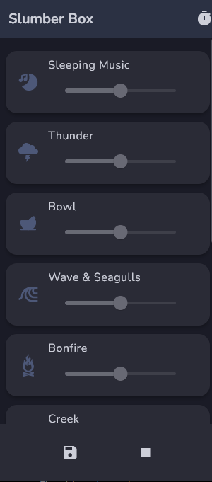

# 🌙 Slumber Box

**Slumber Box** is a calming sleep aid app that helps users relax and fall asleep through soothing music and ambient soundscapes. Whether you’re dealing with stress, insomnia, or just want a peaceful end to your day, Slumber Box offers a simple and effective solution.

## ✨ Features

- 🎶 Curated list of relaxing audio sounds
- ⏱️ Sleep timer that auto-stops playback
- 🌌 Beautiful, dark-themed UI
- 📱 Runs smoothly on both Android and iOS
- 💤 Designed to enhance your nighttime routine

## 📲 Screenshots

> 

## 🚀 Getting Started

Follow these instructions to set up the project locally.

### Prerequisites

- Flutter SDK ([Install guide](https://flutter.dev/docs/get-started/install))
- An Android or iOS device/emulator

### Installation

1. **Clone the repository:**
   ```bash
   git clone https://github.com/your-username/slumber-box.git
   cd slumber-box
   ```
